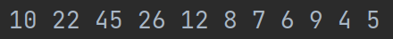
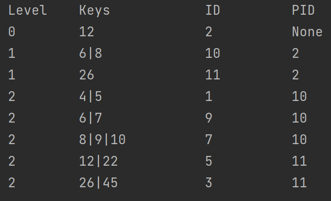
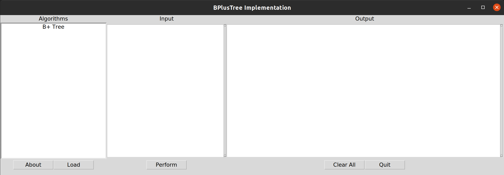

# DBIProject Py3
Database Implementation Project

This project was gathered and designed by Mohammad Amin Rahimi
This project has two different views, the first is the terminal-based view that shows content found on the table layout, and the second is designed in Tkinter in python3.

---
## Simple Run
 input data is \
 
 
and output in terminal is \

finally output in gui is like \
